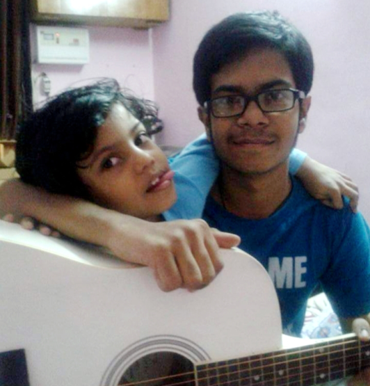
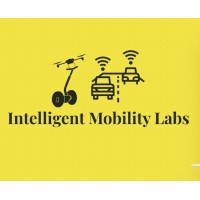
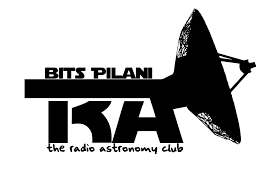
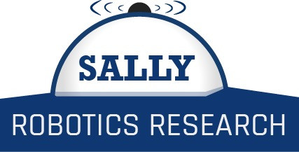
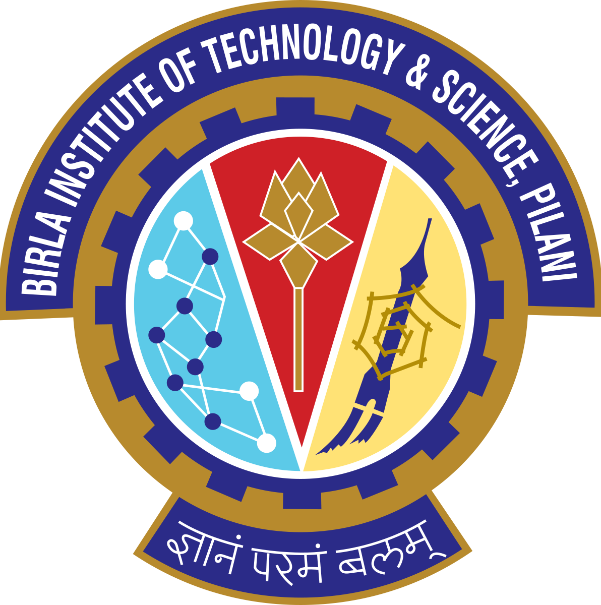

## Welcome to my website

 

### About Me

> I'm a 2nd-year undergraduate student at BITS Pilani, majoring in Mechanical Engineering. 
> 
> My interests lie in robotics research, particularly autonomous navigation and computer vision. I'm fascinated by how machines can contribute more to a sustainable future. In my free time, you may find me reading books, playing guitar or running.

___

 

### Experience

 

#### Intelligent Mobility Labs, Bengaluru

> Robotics Engineer in ROS team
 
> November 2020 - Present

 

#### The Radio Astronomy Club, BITS Pilani

> Deep Learning & Data Analysis team
 
> September 2020 - Present

 

#### Sally Robotics, BITS Pilani

> SLAM researcher in SLAM team
 
> May 2020 - Present

 

#### Computer Science Association, BITS Pilani

> Machine Learning member in ML SIG
 
> January 2020 - Present

___

 

### Education
 

#### Birla Institute of Technology and Science, Pilani, India

> B.E. Mechanical Engineering 
 
> August 2019 - May 2023

 

#### DAV Public School, Sector 14, Faridabad, Haryana, India
> CBSE
 
> 2004-2018

___

 

#### Skills

 

- **Programming & Tools:** Python, C++, Bash, LaTeX, JavaScript, HTML & CSS,SQL, Jupyter Notebook, Conda

- **Operating Systems:** MacOS, Windows 7/8/10, GNU/Linux (Ubuntu 16.04/20.04)

- **Software and Tools:** Git, Docker, Robot Operating System (Kinetic, Melodic &Noetic), RVIZ, Gazebo, Robot Web Tools, MySQL, Django, LTSpice, AutoCAD

- **Libraries:** STL, PyTorch (Torch Vision), Numpy, Scipy, Pandas, MatPlotLib, Seaborn

- **Practices:** Object Oriented Programming, Data Structures & Algorithms, Robotics,Robot Guidance, Navigation & Control, Machine Learning, Deep Learning, ComputerVision, Visual & Visual-Inertial SLAM, Full Stack Web Development

 

### **[My Resume](https://www.overleaf.com/read/hrdhdsjjkcgn)**

___

 

**Look me up on**
-   **   [GitHub](https://github.com/kanishk598)**

-   **   [LinkedIn](https://www.linkedin.com/in/kanishk-vishwakarma-880457190/)**

-   **   [Facebook](https://www.facebook.com/kanishk.vishwakarma.3/)**

-   **   [Instagram](https://www.instagram.com/konixboi/)**

 

___

 

**Contact me**

- **<a href="mailto:f20190315@pilani.bits-pilani.ac.in">Institute Email: f20190315@pilani.bits-pilani.ac.in</a>**

- **<a href="mailto:kanishk.vishwa2001@gmail.com">Personal Email: kanishk.vishwa2001@gmail.com</a>**

- **<a href="tel:+919818393114">Phone: +91 9818393114</a>**

